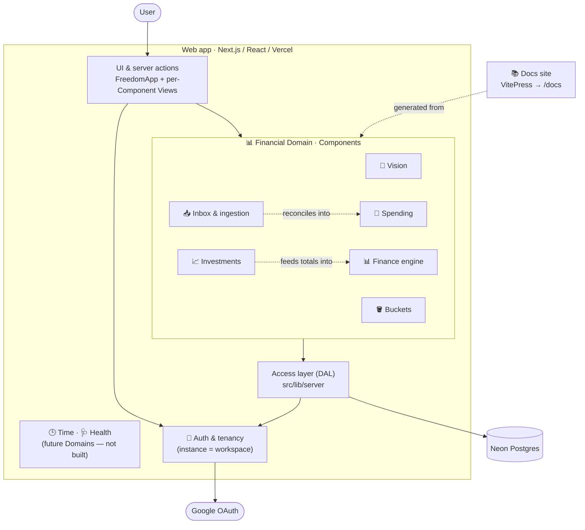

# C2 · Containers

In this app's DDD reading, the **C2 "containers" are the Domains** — the dimensions of personal
freedom the app tracks (Financial, Time, Health) — rather than separate deployable units
(everything ships as one Next.js app on Vercel, with the docs as a static site beside it). Only
the **Financial** Domain is built today; **Time** and **Health** are empty slots in the same
framework.

A Domain is made of **Components** (C3) — its modules, each surfaced as a View in the app and
each owning its model, its rules, and its slice of the UI, depending **inward only**. The
Components below all belong to the Financial Domain.

## The big picture

_Solid arrows are runtime dependencies; dashed arrows are Component relationships and the
docs-generation link._

## The Financial Domain's Components

| Component | Responsibility | Depends on |
|-----------|----------------|------------|
| [🧭 Vision](./components/vision) | The goal and *why* — headline, motivations, FIRE style, target spend. | Finance (FIRE style) |
| [📊 Finance engine](./components/finance) | Pure freedom math: magic number, coast number, projection. | — (pure) |
| [🪣 Buckets](./components/buckets) | Purpose envelopes over real accounts; a recurrence + simulation engine. | — (pure) |
| [📈 Investments](./components/investments) | Holdings, valuation, contributions, DRP, projection. | Buckets (recurrence engine) |
| [💸 Spending](./components/spending) | Observed transactions; annualised spend; the CSV parser. | — (pure) |
| [📥 Inbox & ingestion](./components/inbox) | The capture → extract → propose → reconcile pipeline. | Spending (reconcile target) |

**Auth & tenancy** (🔐 identity via Auth.js + Google, the instance/workspace model, the
authorization choke-point) is **cross-cutting infrastructure**, not a Component of any one
Domain — every Domain's data hangs off an instance and flows through it.

## Cross-cutting rules

These hold across every Component — they're why the model stays modular:

- **Dependencies point inward.** UI → DAL → Component core. A `src/lib/<component>` imports
  nothing framework- or IO-bound, so its core (pure) Elements are unit-testable.
- **The DAL is the only door to data** (`src/lib/server`). It resolves the instance from
  the session and validates every read/write through the Component's zod schema — there is
  no client-supplied id surface. See [C4 · Data model](./data-model).
- **Shared engines, not duplication.** The buckets **recurrence engine** and the
  **detail-view shell** are reused across Components rather than re-implemented.
- **Each Component is validated by behaviours.** Its [Component page](./components/) links to
  the executable [specs](/features/) that pin its rules.

---

Continue to **[C3 · Components →](./components/)**, or jump to **[C4 · Data model →](./data-model)**.
