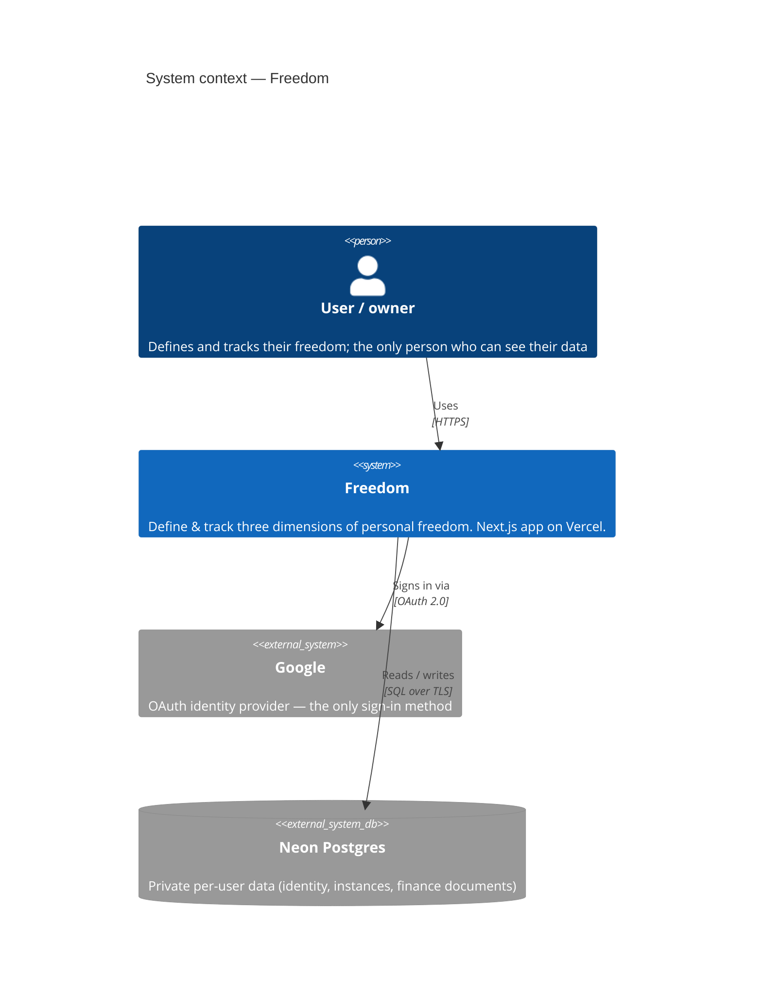

# C1 · Context

> **The C4 model, top-down.** This **Architecture** section is the *structural* view of
> Freedom, organised by [C4](https://c4model.com): **C1 Context** (this page) → **C2
> [Containers](./containers)** (the **Domains**) → **C3 [Components](./components/)** (the
> modules of a Domain, generated per Component) → **C4 [Data model](./data-model)** (the
> schema). It complements the [Behaviours](/features/) section, which is the *dynamic* view
> — what the app does, as executable specs. Structure and behaviour, cross-linked.

## Taxonomy — the words this app uses

Three nested altitudes, mapped onto C4. Use these consistently:

| Altitude | Term | Is | Examples |
|----------|------|----|----------|
| **C2 · Container** | **Domain** | a dimension of personal freedom | Financial (built), Time, Health |
| **C3 · Component** | **Component** *(in code/React: **View**)* | a module within a Domain | Vision, Trajectory, Investments, Buckets, Spending, Inbox |
| **C4 · Code** | **Element** | a UI/code building block of a Component | a `*Panel`, a chart widget, a `*Editor`/`*Modal`, plus its `types`/`index`/server files |

Disambiguation rules:
- **"Dimension"** is the outward, experiential synonym for **Domain** (e.g. the tagline "Three
  dimensions of mastery"); architecture and code say **Domain**.
- **Component** (the architectural module) and **View** (its name in `.tsx`/React code — the
  `FinancialView` type) are **synonyms**. We use "View" in code to avoid colliding with "React
  component", and "Component" in docs.
- An **Element** *is* a React component, but we call it an Element when talking architecture.

## Why Freedom exists

Freedom is a private, personal app to **define and track three dimensions of personal
freedom**. For each dimension you (1) project your goals and *why* they matter, (2) capture
your current state, then (3) track the trajectory and ETA to the goal — visual and
interactive, not a spreadsheet.

The dimension built today is **financial freedom**: capture the vision and target spend,
work out the "magic number", record net worth and holdings, and see the projected
**freedom date**. Time and Health are slots in the same framework, not yet built.

It is **private, per-user data** behind a real full-stack app — auth, a database, and
multi-tenancy from day one — not a static toy.

## System context

### Actors & external systems

| Actor / system | Role |
|----------------|------|
| **User / owner** | The signed-in person. Sees only their own workspace(s); authorization is owner-only today. |
| **Google** | OAuth identity provider — the sole sign-in method. We store only the identity link, never a password. Sign-in is allowlisted (`AUTH_ALLOWED_EMAILS`). |
| **Neon Postgres** | The system of record. All user data is multi-tenant and segregated by instance. |

### Planned external systems (not wired yet)

| System | Future role |
|--------|-------------|
| **Open Banking / Plaid** | Automated transaction ingestion, behind the existing inbox seam. |
| **Market-data / broker feed** | Live holding prices, behind the `PriceProvider` seam. |

Today both are **manual**: statement CSVs are dropped into the [inbox](./components/inbox),
and holding prices are entered by hand.

---

Continue to **[C2 · Containers →](./containers)**.
